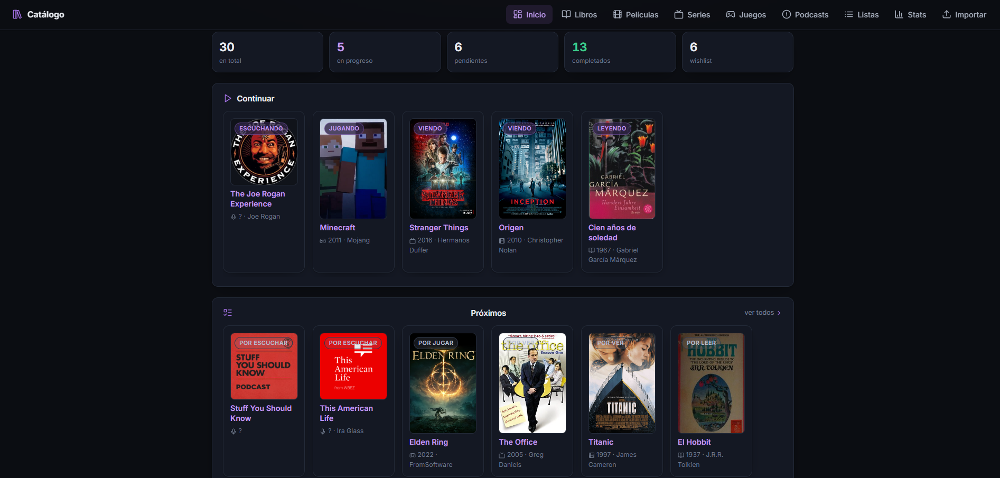
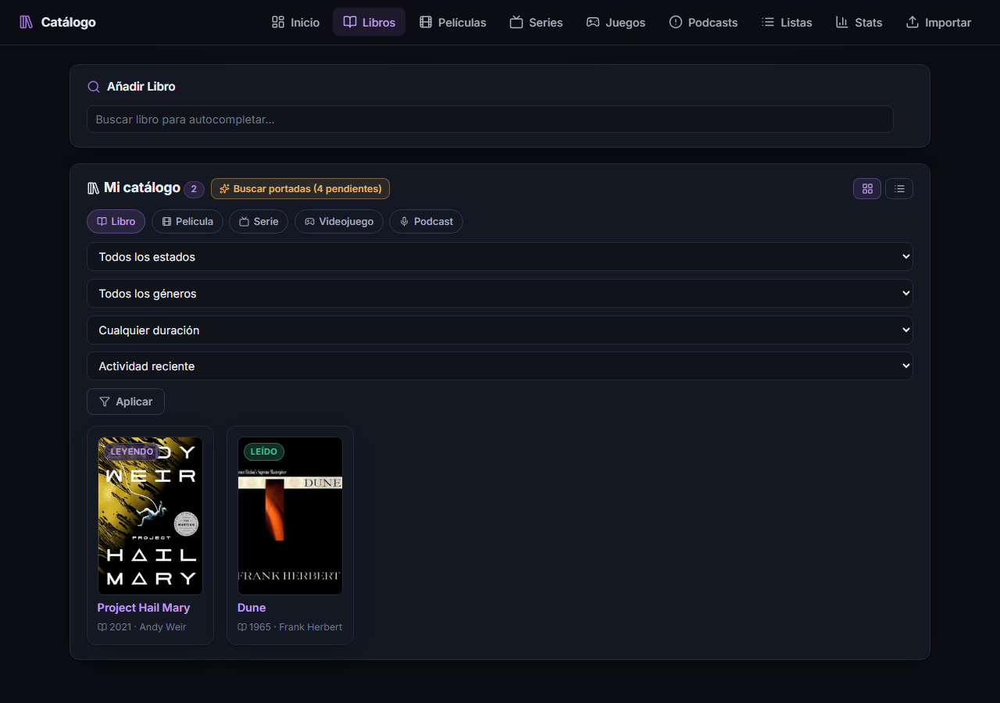
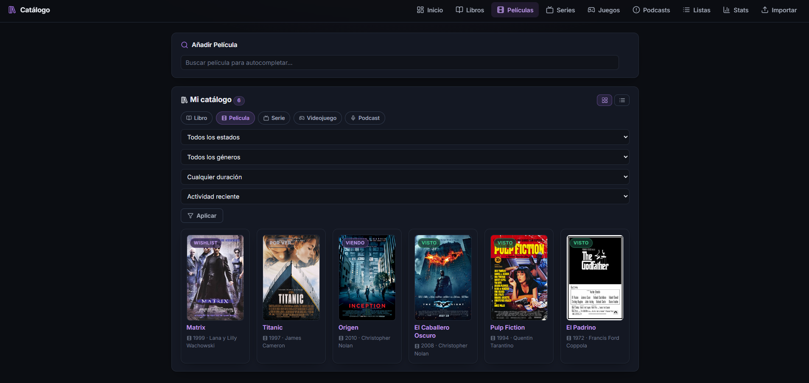
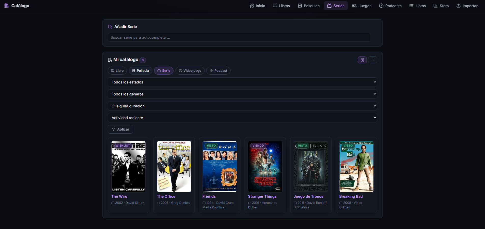
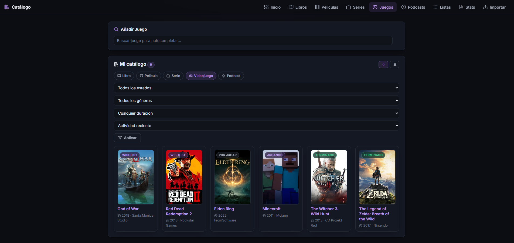
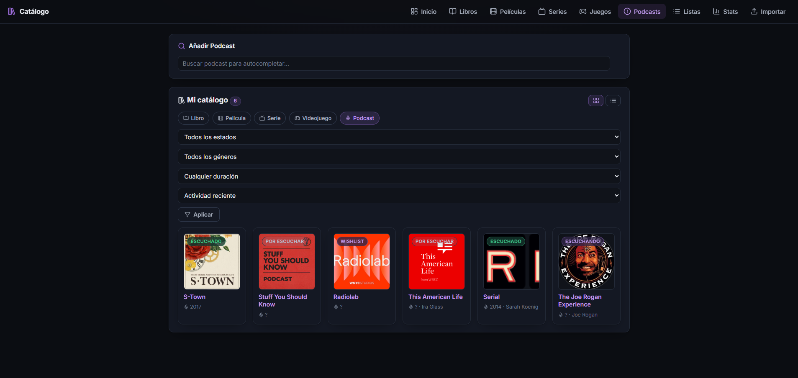
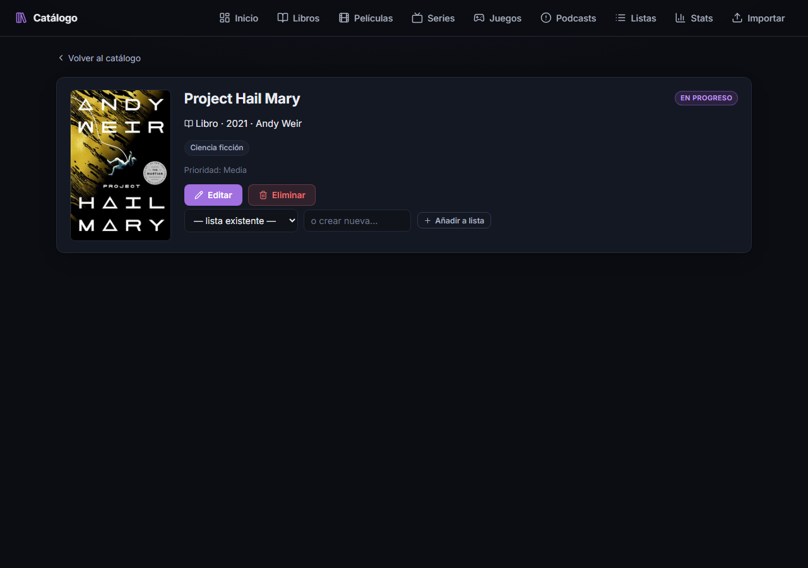
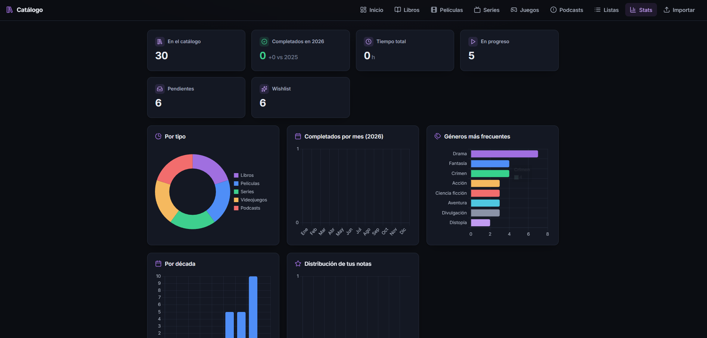
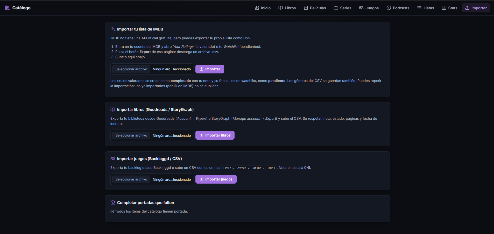

# Media Catalog

A self-hosted, single-user catalog for books, movies, series, video games and
podcasts — track what you're watching/reading/playing, what's next, and what's
still on your wishlist. Runs as one small Docker container against a local
SQLite file. No account, no cloud, no paid API required.



<details>
<summary>More screenshots (catalog, movies, series, games, podcasts, item detail, stats, import)</summary>










</details>

## Features

- **One catalog, five media types**: books, movies, series, video games, podcasts.
- **Search & autocomplete** while adding items, backed by free metadata APIs
  (see [Configuration](#configuration) — every source is optional).
- **Status tracking**: wishlist → pending → in progress → completed / abandoned.
- **Episode tracking** for series and podcasts (season/episode, watched state,
  automatic "next up").
- **Progress tracking** for anything else (page N/300, 45%, etc).
- **Ratings, notes, tags, and custom lists** ("watch with my partner", "top 2026"...).
- **Sagas/franchises**: grouped automatically via TMDB collections, editable manually.
- **Stats page** and a "suggest me something" random pick.
- **Calendar view** for upcoming episodes and release dates.
- **CSV import**: IMDb (ratings/watchlist), Goodreads/StoryGraph (books), and
  Backloggd or a generic CSV (games) — with batch cover-art enrichment afterward.
- **Optional Telegram alerts**: new episode aired, wishlist item now available.
- **Automatic daily backups** of the SQLite database, with rotation.
- **Optional HTTP Basic auth**, for when you expose it beyond your LAN (e.g. via Tailscale).

## Why

Most "watched/read/played" trackers are either a spreadsheet or a SaaS product
that wants your data and a subscription. This is neither: it's a single
container, a single SQLite file, and a UI that doesn't get in the way. If you
already self-host things at home, this slots in next to them.

## Tech stack

FastAPI + SQLAlchemy 2.0 + SQLite + Jinja2, with HTMX for the bits that need
live interactivity (search, batch enrichment). No frontend build step, no
npm/webpack/vite — HTMX and the Inter font are vendored in `app/static/`, so
the app renders and functions with zero calls out to the internet other than
the metadata APIs you choose to configure.

## Quick start

```bash
git clone https://github.com/PabloRS98/Content-Media-Manager.git
cd Content-Media-Manager
cp .env.example .env   # optional: add free API keys, see below
docker compose up -d --build
```

Open `http://localhost:8002`. Data lives in the `media_data` Docker volume
(one SQLite file); back it up by copying that file, or rely on the built-in
daily backup job.

## Configuration

Every setting is an environment variable (see `.env.example`), and **every
single one is optional** — there is no paid API anywhere in this project, and
nothing is hardcoded. Leaving a key empty just disables that one metadata
source; everything else keeps working.

| Variable | Purpose | Get it here |
|---|---|---|
| `TMDB_API_KEY` | Movie/series posters, cast, episodes, release dates | Free account at [themoviedb.org](https://www.themoviedb.org/) → Settings → API → request a "Developer" key |
| `RAWG_API_KEY` | Video game covers & metadata | Free account at [rawg.io/apidocs](https://rawg.io/apidocs) → dashboard |
| `GOOGLE_BOOKS_API_KEY` | Higher-quota book search fallback | Optional — works keyless at low volume; key at [console.cloud.google.com](https://console.cloud.google.com/) (enable "Books API") |
| `TELEGRAM_BOT_TOKEN` / `TELEGRAM_CHAT_ID` | Episode/release notifications | Create a bot via [@BotFather](https://t.me/BotFather), then message it and check `api.telegram.org/bot<TOKEN>/getUpdates` for your chat id |
| `ENABLE_AUTH`, `AUTH_USERNAME`, `AUTH_PASSWORD` | HTTP Basic auth | — |
| `DB_PATH`, `BACKUP_KEEP`, `TIMEZONE` | Storage & scheduling | — |

Books via **Open Library** and podcasts via **iTunes Search** need no key at
all — they're on by default.

## Development

```bash
pip install -r requirements.txt
uvicorn app.main:app --reload --port 8000
```

The app expects a writable `/data` directory (or set `DB_PATH` to a local
path when running outside Docker).

## Contributing

Issues and pull requests are welcome — see [CONTRIBUTING.md](CONTRIBUTING.md).

## License

MIT — see [LICENSE](LICENSE).
